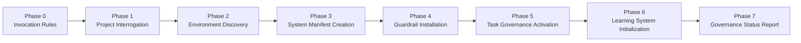
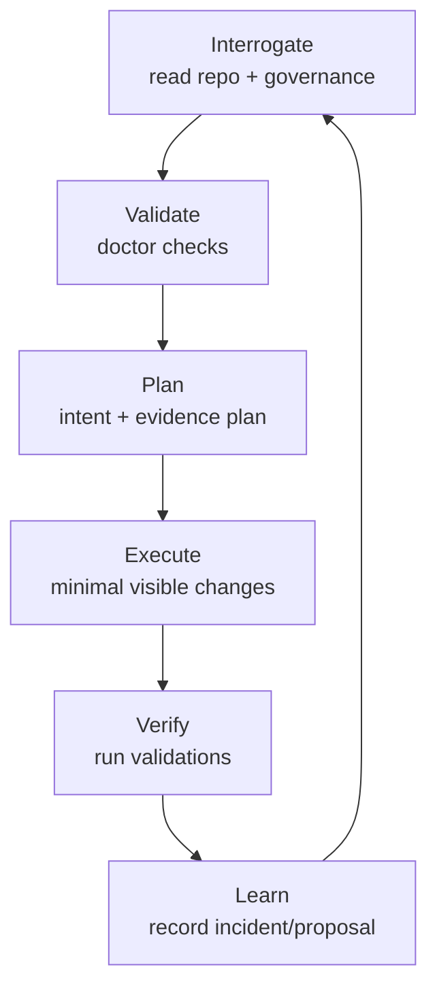
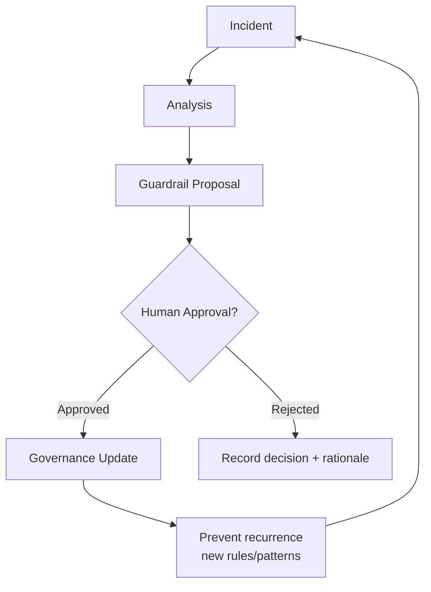

# Governance Model (Platform-Neutral)

This document provides an end-to-end explanation of the governance system using platform-neutral diagrams.

Key references:
- Constitution: `../constitution/AI_ENGINEERING_CONSTITUTION.md`
- Bootstrap protocol: `../bootstrap/BOOTSTRAP_PROMPT.md`
- Project interrogation: `../bootstrap/project-interrogation.md`
- Guardrails: `../guardrails/baseline-rules.yaml`
- Validation patterns: `../guardrails/validation-patterns.yaml`
- Learning loop: `../learning/lessons-schema.md`
- Agent contract: `../agents/agent-behaviour.md`

## 1) Governance Architecture
```mermaid
flowchart TB
	subgraph Repo[Governed Repository]
		GOV[Governance Artifacts\n(.governance/*)]
		PROF[Project Profile\nproject-profile.json]
		MAN[System Manifest\nsystem-manifest.json]
		GR[Guardrails\nbaseline-rules.yaml]
		VP[Validation Patterns\nvalidation-patterns.yaml]
		EVD[Evidence Store\n(.governance/evidence/*)]
		LL[Learning Records\n(.governance/learning/*)]
	end

	AG[AI Agent]
	H[Human Approver]

	AG -->|reads| GOV
	GOV --> PROF
	GOV --> MAN
	GOV --> GR
	GOV --> VP

	AG -->|produces evidence| EVD
	AG -->|records incidents/proposals| LL
	LL -->|approval required| H
	H -->|approves updates| GOV
```

## 2) Bootstrap Flow


## 3) Agent Execution Loop


## 4) Learning Feedback Loop

